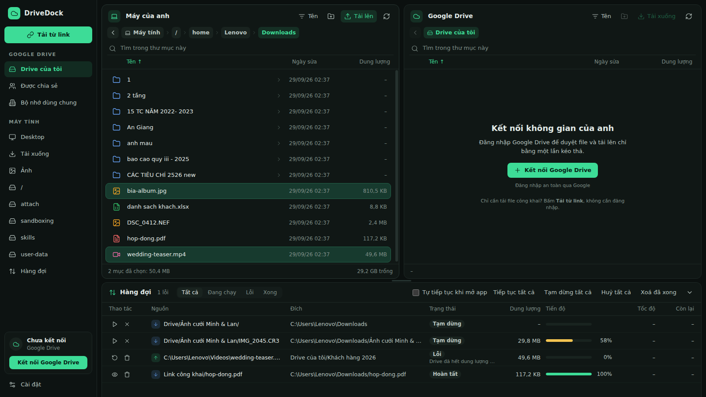
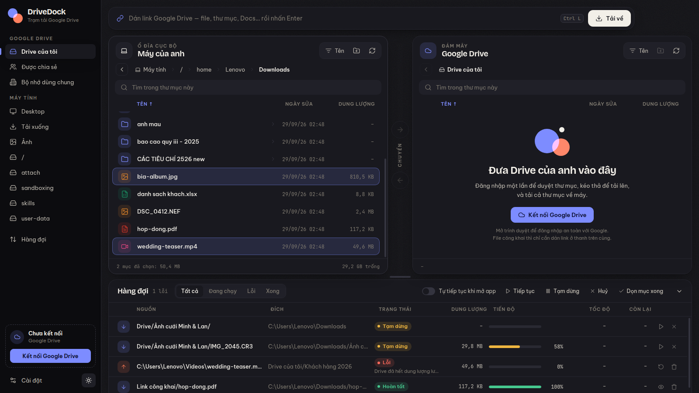

# DriveDock

Phần mềm desktop để **tải xuống / tải lên Google Drive**, ý tưởng giống Air Explorer nhưng tập trung vào việc chuyển file nhanh và không phải trông chừng.

**Cách dùng nhanh nhất:** dán link Google Drive vào thanh trên cùng (hoặc `Ctrl+L`, hoặc dán ở bất kỳ đâu trong app), xem trước tên và dung lượng, chọn thư mục lưu rồi bấm **Tải xuống**.



<details><summary>Giao diện tối</summary>



</details>

**Thiết kế "Paper & Cobalt":** nền giấy ấm, chữ màu mực; **xanh cobalt** nghĩa là *tải về máy*, **cam đỏ** nghĩa là *tải lên Drive*, dùng nhất quán ở nút chuyển giữa hai khung, hàng đợi và thanh tiến độ. Chữ tiêu đề dùng *Bricolage Grotesque*, chữ nội dung dùng *Be Vietnam Pro* (thiết kế riêng cho tiếng Việt), số liệu dùng *JetBrains Mono*. Font được đóng gói sẵn trong app, không cần mạng. Có giao diện tối, bấm nút mặt trăng ở góc dưới thanh bên.

## Tính năng

- **Tải bằng link**: file, thư mục (tải cả cây thư mục con), link Docs/Sheets/Slides, link có `resourcekey`, dán nhiều link cùng lúc. Link được kiểm tra trước để anh thấy tên và dung lượng trước khi tải.
- **Không cần đăng nhập với file công khai**: file "Bất kỳ ai có link" tải được ngay, kể cả file lớn có cảnh báo "không quét được virus". Thư mục công khai cần đăng nhập hoặc một API key.
- **Hai khung, kéo thả**: bên trái là máy tính, bên phải là Google Drive (Drive của tôi, Được chia sẻ, Bộ nhớ dùng chung). Kéo từ khung này sang khung kia để tải lên / tải xuống, kéo thẳng vào một thư mục, hoặc kéo file từ Explorer vào khung Drive.
- **Hàng đợi bền bỉ**:
  - chạy song song nhiều file (1–8, chỉnh trong Cài đặt);
  - tạm dừng / tiếp tục / huỷ từng file hoặc tất cả;
  - **tải tiếp từ chỗ bị ngắt**: tải xuống dùng file tạm `.drivedock-part` và HTTP Range; tải lên dùng phiên resumable của Google, nên mất mạng hay tắt app đều không phải làm lại từ đầu;
  - tự thử lại khi mất mạng hoặc khi Google giới hạn tốc độ (backoff tăng dần);
  - hàng đợi được lưu lại, có tuỳ chọn *Tự tiếp tục khi mở app*.
- **Tăng tốc đa kết nối**: file từ 16 MB trở lên được chia thành nhiều đoạn và tải song song (mặc định 4 kết nối mỗi file, chỉnh được 1–8). Kết nối nào xong sớm sẽ tự nhận nửa phần còn lại của đoạn chậm nhất, nên không có kết nối nào ngồi chờ. Vị trí từng đoạn được lưu lại, nên vẫn tải tiếp được sau khi mất mạng hay tắt app. Nếu máy chủ không hỗ trợ tải theo đoạn thì app tự chuyển về một luồng.
- **Đồng bộ thư mục an toàn**: bấm nút đồng bộ ở cột giữa để so sánh thư mục đang mở ở hai khung. App liệt kê file thiếu ở mỗi bên và file khác nhau, anh xem trước rồi mới chạy. Chỉ copy phần thiếu, **không bao giờ xoá**. File khác nhau chỉ bị thay khi anh tick chọn (bản mới hơn thắng, bản Drive cũ vẫn còn trong lịch sử phiên bản). Google Docs/Sheets/Slides và shortcut được bỏ qua.
- **Lịch tự động** (mục *Lịch tự động* ở thanh bên): hẹn giờ **tải link** hoặc **đồng bộ thư mục** hằng ngày, vài ngày trong tuần, cách N phút/giờ, hoặc một lần. Đồng bộ theo lịch có thể chỉ tải lên (sao lưu), chỉ tải về, hoặc hai chiều, và không bao giờ xoá file. Mỗi lịch hiện lần chạy tiếp theo và kết quả lần trước, có nút *Chạy ngay*. Lịch chỉ chạy khi DriveDock đang mở; nếu lỡ giờ vì đã tắt app thì lịch chạy bù một lần ngay khi mở lại.
- **Khung giờ chạy hàng đợi** (Cài đặt): chỉ truyền file trong khoảng giờ anh chọn, ví dụ 23:00–06:00 để dùng mạng ban đêm. Ngoài khung giờ, file đang chạy được tạm dừng và giữ nguyên tiến độ, sáng ra tự chạy tiếp.
- **Giới hạn tốc độ** tải xuống và tải lên riêng biệt, áp dụng tức thì cho các file đang chạy.
- **Kiểm tra MD5** sau khi tải xuống, phát hiện được file hỏng.
- **Google Docs / Sheets / Slides** được xuất sang Office (hoặc PDF / OpenDocument), kể cả file lớn quá giới hạn của API export.
- **Xử lý trùng tên**: tự đổi tên (`ảnh (1).jpg`), bỏ qua, hoặc ghi đè (trên Drive thì tạo phiên bản mới, không tạo file trùng).
- Giữ nguyên ngày sửa của file, xử lý tên file có ký tự Windows không cho phép.
- Tìm kiếm không dấu trong thư mục ("tieu chi" khớp "TIÊU CHÍ"), sắp xếp theo tên / ngày / dung lượng, chọn nhiều file bằng Ctrl/Shift, menu chuột phải, phím tắt.
- Token đăng nhập được mã hoá bằng kho khoá của hệ điều hành (DPAPI trên Windows).

## Cài đặt và chạy

### Cách 1: tải file .exe đã build sẵn

Mỗi lần có code mới được push, GitHub Actions tự build bản Windows. Vào tab **Actions** của repo → chọn lần chạy mới nhất → tải artifact **DriveDock-windows** (gồm bản cài đặt và bản portable).

### Cách 2: chạy từ mã nguồn

Cần [Node.js 20+](https://nodejs.org).

```bash
npm install
npm start
```

Tự build file cài đặt: `npm run dist:win` (kết quả nằm trong thư mục `dist/`).

## Kết nối Google Drive (làm một lần)

DriveDock dùng OAuth Client của chính anh (miễn phí), nên hạn mức API là của riêng anh và không đi qua máy chủ trung gian nào.

1. Mở [Google Cloud Console](https://console.cloud.google.com/projectcreate) và tạo một project.
2. Bật [Google Drive API](https://console.cloud.google.com/apis/library/drive.googleapis.com).
3. Vào [Google Auth Platform](https://console.cloud.google.com/auth/overview), chọn *External*, rồi thêm email của anh vào **Test users**.
   Khi app còn ở chế độ *Testing*, Google bắt đăng nhập lại sau 7 ngày. Bấm **Publish app** (không cần xác minh nếu chỉ anh dùng) để không bị như vậy.
4. Vào [Clients](https://console.cloud.google.com/auth/clients), bấm **Create client**, chọn loại **Desktop app**, rồi tải file JSON về.
5. Trong DriveDock: **Cài đặt**, bấm **Nhập từ credentials.json**, **Lưu**, rồi **Kết nối Google Drive**. Trình duyệt sẽ mở ra để anh đăng nhập.

Muốn tải thư mục công khai mà không đăng nhập thì tạo thêm một **API key** (Credentials → Create credentials → API key) và dán vào Cài đặt.

## Phím tắt

| Phím | Tác dụng |
| --- | --- |
| `Ctrl+L` / dán link | Đưa con trỏ vào thanh dán link |
| `Enter` / nhấp đúp | Mở thư mục / file |
| `Backspace` | Lên thư mục cha |
| `F5` | Làm mới |
| `F2` | Đổi tên |
| `Delete` | Xoá (vào Thùng rác / thùng rác Drive) |
| `Ctrl+A` | Chọn tất cả |
| Gõ chữ bất kỳ | Tìm trong thư mục |

## Cấu trúc mã nguồn

```
src/main/        tiến trình chính (Node)
  main.js        cửa sổ, IPC
  auth.js        OAuth 2.0 loopback + PKCE, lưu token mã hoá
  drive.js       client Drive REST v3: liệt kê, tải, export, resumable upload, retry
  transfers.js   logic tải xuống / tải lên từng file và thư mục
  segmented.js   tải một file lớn bằng nhiều kết nối
  schedule.js    lịch tự động và khung giờ
  sync.js        so sánh hai thư mục để đồng bộ
  throttle.js    giới hạn tốc độ
  queue.js       hàng đợi: song song, tạm dừng, thử lại, lưu trạng thái
  links.js       nhận diện mọi dạng link Google Drive
  local.js       duyệt ổ đĩa trên máy
src/preload.js   cầu nối an toàn giữa giao diện và tiến trình chính
src/renderer/    giao diện (HTML/CSS/JS thuần, không cần build)
test/            test (node --test)
```

Chạy test: `npm test`.
